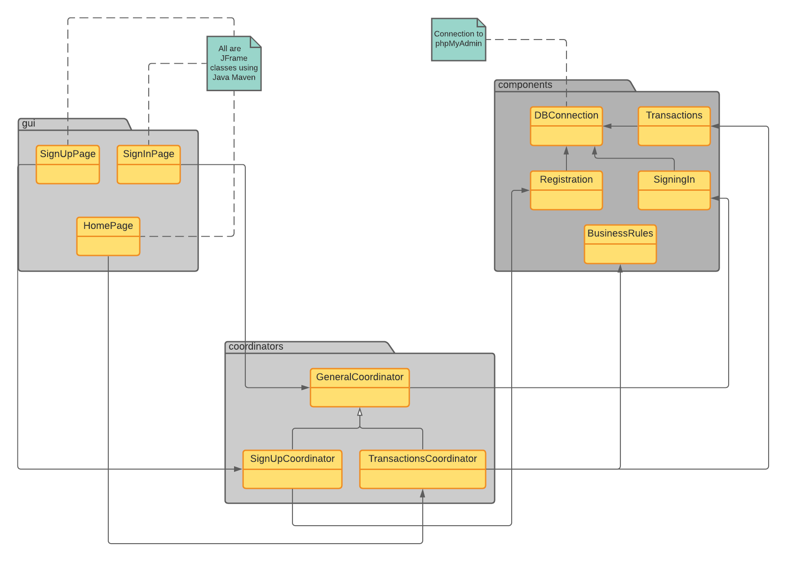
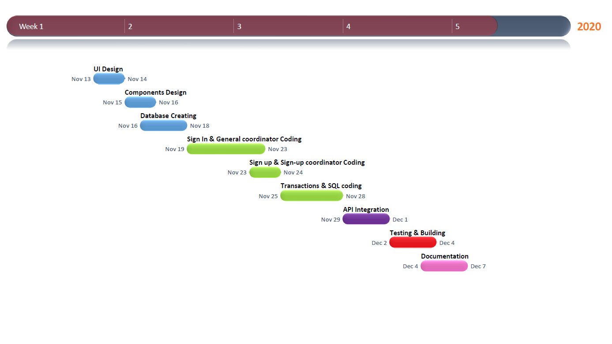

# Project Documentation
This document involves programming naming conventions and the documentation of the project.
  
***
## Table of Contenets
* [Design](#Design)
* [UML Diagram](#UML-Diagram)
* [Choice of Programming Language](#Choice-of-Programming-Language)
* [Our Location on The Technology Wave](#Our-Location-on-The-Technology-Wave)
* [Selection of Major Constraction Practices](#Selection-of-Major-Constraction-Practices)
* [Tasks Schedule](#Tasks_Schedule)
* [Programming Naming Conventions](#Programming-Naming-Conventions)
* [Formatting & Comments](#Formatting-&-Comments)
* [Project features](#Project-features)
***
## Design  
  * ### Packages and Classes:
    The project is divided into three main packages as the following :
    * __components:__  contains the main classes.
        * DBConnection
        * BusinessRules
        * Transactions
        * SigningIn
        * Registration
        
    * __gui:__ contains JFrames.
       * HomePage
       * SignInPage
       * SignUpPage
         
    * __coordinators:__ contains classes that link the _gui_ and _components_.
        * GeneralCoordinator  (_Super Class_)
        * SignUpCoordinator   (_Sub Class_)  
        * TransactionsCoordinator  (_Sub Class_)
        
***
## UML Diagram:  

  
       

   

***  
## Choice of Programming Language

 * ### Programming Language:
   As choosing a familiar programming language increases productivity, I chose Java since I'm more familiar with its libraries. On the other hand, I used Maven (software project management and comprehension tool) since it allows to handle dependencies easily and to specify the details of building the project and creating the JAR file. Choosing Java also helped to find multiple APIs to send an OTP to the user's email.

 ***
 ## Our Location on The Technology Wave
 Fortunately, the project can be done using late-wave programming, where everything is well documented and integrated, it also helps to find solutions to any problem easily.
 ***
 ## Selection of Major Constraction Practices
The coding process follows the solo development approach and by using some online resources to solve an issue, in addition to testing and debugging the code each time a new requirement is added. 
  
 * ### Tools:
    - **IDE:** Apache NetBeans IDE 12.0
    - **Build Automation Tool:** Apache Maven.
    - **JDK Version:** JDK-14.0.2
    - **Version Conrol:** GitHub.
    - **Email Sending API:** SendGrid.
    - **Documentation Generator :** Javadoc.
    - **Database Management System:** MySQL.
    - **Database Administration Tool:** phpMyAdmin.
    - **Database Hosting:** Local host using XAMPP.
    - **Java Executable Wrapper:** Launch4j.
 ***
 ## Tasks Schedule
 

  
       

      
  
 ***
## Programming Naming Conventions
* ### Packages Naming:  
  Packages' names should be written in all lower case to avoid conflict with the names of classes or interfaces.  
  ##### Example:    

    | Okay          | Not Okay    |
    | --------------| ------------|
    | `components` | `AllComponents`|    

* ### Classes Naming:
  Classes names should be nouns, in mixed case with the first letter of each internal word capitalized. Try to keep class names simple and descriptive.  
  ##### Example:  
    | Okay          | Not Okay    |
    | --------------| ------------|
    | `class BankAccount` | `class bankAccounts `|   
 
* ### Methods Naming:
  Methods should be verbs, in mixed case with the first letter lowercase, with the first letter of each internal word capitalized.  
  ##### Example:  
    | Okay          | Not Okay    |
    | --------------| ------------|
    | `getAccountNum()` | `AccountNum()`|    
    |`isNumeric()` | `checkIsNumeric()`|
* ###  Variables Naming:
  Variables, instances, and constants are in mixed case with a lowercase first letter. Internal words start with capital letters. Variable names should be short yet meaningful and not start with underscore _ or dollar sign $ characters, even though both are allowed.  
  ##### Example:  
    | Okay          | Not Okay    |
    | --------------| ------------|
    | `phoneNumber` | `num`|  
    | `custmorName` | `custName`|
* ###  Constants Naming:  
  constants should be all uppercase with words separated by underscores ("_").  
  ##### Example:  
    | Okay          | Not Okay    |
    | --------------| ------------|
    | `MIN_WIDTH ` | `minWIDTH`|  
 
* ### Other:
  Some personal conventions and shortcuts. 
  ##### Example:  
    | Example          | Shortcut   |
    | --------------| ------------|
    | `accountNumber` | `accountNum`|  
    | `getPassword()` | `getPass()`|
    | `nameJTextField` | `nameField`|
    | `passJPasswodField` | `passField`|
    | `firstPassword` | `pass1`|
    | `generateAccountNumber()` | `genAccountNum()`|
    | `minimum` | `min`|
    
***
## Formatting & Comments
  ### Format:  
  * Use defulat NetBeasns formatting by pressing : `Alt + Shift + F`.
  * Leave space beteen variables/methods and comparison/assinment symbols : `int age = 15;` , `if (age == 24)`.
  ### Comments & javaDoc :
  * Comments are only added to clarify any vague code.
  * Javadoc shall be added to each class, method, and variable, with a brief description including the parameters and return value.
 
***
## Project features
  ### The Specified Business Rules:  
  The user is allowed to perform a maximum of 5 transactions per day :  
  
  1. Withdrawal :  
      * The maximum amount per each withdrawal operation is: 5000.0  
      * The minimum amount per each withdrawal operation is: 50.0 
  2. Deposit :  
      * The maximum amount per each deposit operation is: 12000.0  
      * The minimum amount per each deposit operation is: 100.0  
  3. Transfer :  
      - The maximum amount per each transfer operation is: 10000.0  
      - The minimum amount per each transfer operation is: 1000.0  
  ### Signing In & OTP :
  * The user can sign in using the 6-digits account number and password.
  * The user can sign in using the account number and an OTP that's sent the email associated with the account number. The OTP is randomly generated and sent to the  
  user's email by using _**SendGrid API**_ .  

    
  

  
  

